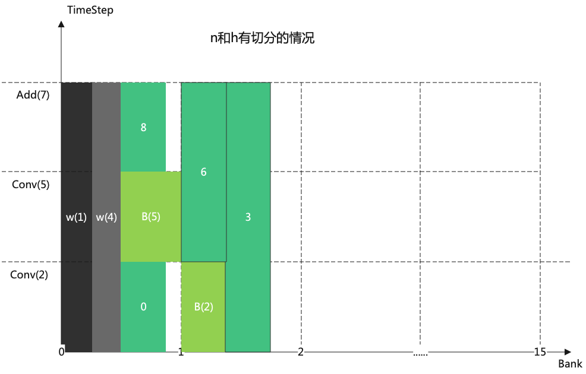

# Layer Group

* content
{:toc}

## 基本思想

**要解决的问题：** 如何使Layer数据保持在有限的Local Memory进行运算，而不是反复进行Local与Global Memory之间的拷贝？

**基本思路**：通过切N和H，使每层Layer的运算始终在Local Memory中，如下举例：

## Backward

对网络切分的时候，大多数Layer输入和输出的shape是一致的。但是对于Conv、Pool等等需要特别计算：

## Group划分

#### 划分Mem周期

如何划分group? 首先把每一层Layer需要的lmem罗列出来，大体可以归为三类：

1. Activation Tensor，用于保存输入输出结果，没有使用者后直接释放
2. Weight，用于保存权重，**不切的情况下用完就释放；否则一直驻留在lmem**
3. Buffer，用于Layer运算保存中间结果，用完就释放

然后依次广度优先的方式配置id，如下举例：

然后在配置周期，配置方法如下：

#### 划分最优Group

当前策略：

1. 优先不做任何切分的情况下将尽可能多的Layer做group。因为不切时weight用完是可以释放的。

2. 优先切N，当N切到最小单位时（1686最小单位是1，1684最小单位是4）还不能满足要求，则切h；h不能切的过多，因为Conv、Pool等等算子会有重复数据部分，h切的过多导致重复部分过多，目前的策略为当backward后的layer的输入，如果**h_slice重复的部分>h/2，则认为失败**。

举例：

比如input的h = 100，经过切分后变成2个input，h[0, 80)和h[20, 100)，则重复部分为60，则认为失败；

2个input对应h[0, 60)和h[20, 100)，重复部分为40，认为成功。

此处为**简单有效策略**，也是代码中实现的策略；理论上应该有性能更优的策略，比如计算不同group后网路的cycle，但这种策略过于复杂。**建议后续进一步优化策略**

#### 分叉Layer如何Group ?

如上场景，从输出Slice倒推到交汇的Conv。

**当前实现**：如果slice不一致则出错

**未来实现**：Slice采用**并集**。这就导致每个tensor不仅要记录当期的`h_idx`(可理解为偏移)和`h_slice`(可理解为长度)，还要记录Op需要的`h_idx`和`h_slice`。

## Local Memory分配

n和h有切分的情况下，weight常驻local mem，可以先分配，如下图：

当n和h都没有切分的情况下，weight和tensor一样，不使用时直接释放，如下：

那么Lmem分配问题就可以转换成这些方块如何摆放问题（注意方块只能左右移动，不能上下移动）。另外lmem分配时优先不要跨bank。

目前策略是按照op顺序依次分配，优先分配timestep长的，次分配lmem大的。目前不是最优策略，后续**待优化**。

