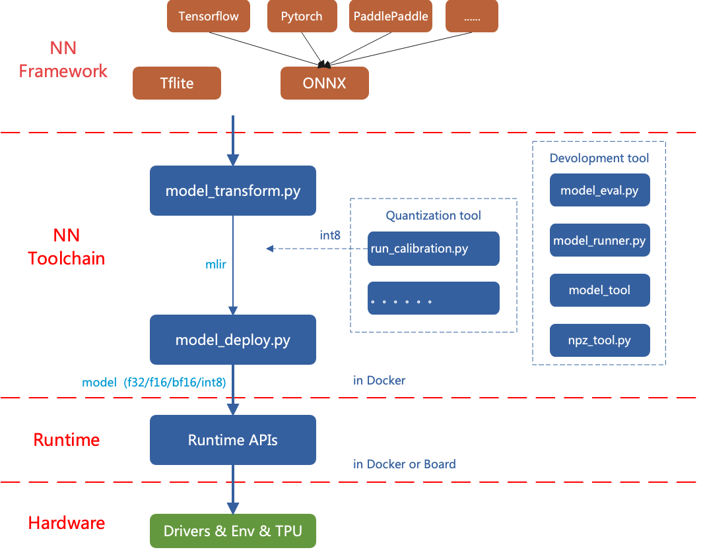

# TPU-MLIR快速入门指南


>文档版本: 0.1.0
>
>发布日期: 2022-07-21
>
>适用于 BM1684x芯片


© 2022 北京算能科技有限公司

本文件所含信息归<u>北京算能科技有限公司</u>所有。

未经授权，严禁全部或部分复制或披露该等信息。

<div STYLE="page-break-after: always;"></div>

## 法律声明

本数据手册包含北京算能科技有限公司（下称"算能"）的保密信息。未经授权，禁止使用或披露本数据手册中包含的信息。如您未经授权披露全部或部分保密信息，导致算能遭受任何损失或损害，您应对因之产生的损失/损害承担责任。

本文件内信息如有更改，恕不另行通知。算能不对使用或依赖本文件所含信息承担任何责任。

本数据手册和本文件所含的所有信息均按"原样"提供，无任何明示、暗示、法定或其他形式的保证。算能特别声明未做任何适销性、非侵权性和特定用途适用性的默示保证，亦对本数据手册所使用、包含或提供的任何第三方的软件不提供任何保证；用户同意仅向该第三方寻求与此相关的任何保证索赔。此外，算能亦不对任何其根据用户规格或符合特定标准或公开讨论而制作的可交付成果承担责任。

<div STYLE="page-break-after: always;"></div>


##  目录

* content
{:toc}


<div STYLE="page-break-after: always;"></div>


## 1 TPU-MLIR简介

TPU-MLIR是算能智能AI芯片的TPU编译器工程。该工程提供了一套完整的工具链，其可以将不
同框架下预训练的神经网络，转化为可以在算能TPU上高效运算的二进制文件`bmodel`。代码
已经开源到github: <https://github.com/sophgo/tpu-mlir>

TPU-MLIR的整体架构如下：



<div STYLE="page-break-after: always;"></div>

## 2 开发环境配置

从[DockerHub](https://hub.docker.com/r/sophgo/tpuc_dev)下载所需的镜像:

``` shell
docker pull sophgo/tpuc_dev:v1.1
```

如果是首次使用docker，可执行下述命令进行安装和配置（仅首次执行）:

```shell
sudo apt install docker.io
systemctl start docker
systemctl enable docker

sudo groupadd docker
sudo usermod -aG docker $USER
newgrp docker (use before reboot)
```

确保安装包在当前目录，然后在当前目录创建容器如下：

``` shell
# myname只是举个名字的例子，请指定成自己想要的容器的名字
docker run --privileged --name myname -v $PWD:/workspace -it sophgo/tpuc_dev:v1.1
```

后文假定用户已经处于docker里面的/workspace目录。

<div STYLE="page-break-after: always;"></div>

## 3 编译onnx模型

本章以resnet18.onnx为例，介绍如何编译迁移一个onnx模型至BM1684x TPU平台运行。

如何将其他深度学习架构的网络模型转换成onnx，可以参考onnx官网: <https://github.com/onnx/tutorials>

本章需要如下文件(其中xxxx对应实际的版本信息)：

* tpu-mlir_xxxx.tar.gz

### 步骤 0：加载tpu-mlir

``` shell
tar zxf tpu-mlir_xxxx.tar.gz
source tpu-mlir_xxxx/envsetup.sh
```

### 步骤 1：准备工作目录

建立`model_resnet18`目录，注意是与tpu-mlir同级目录；并把模型文件和图片文件都放入`model_resnet18`目录中。

``` shell
mkdir model_resnet18 && cd model_resnet18
cp $TPUC_ROOT/regression/model/resnet18.onnx .
cp -rf $TPUC_ROOT/regression/ILSVRC2012 .
cp -rf $TPUC_ROOT/regression/image .
mkdir workspace && cd workspace
```

这里的`$TPUC_ROOT`是环境变量，对应tpu-mlir_xxxx目录

### 步骤 2：模型转MLIR

如果模型是图片输入，在转模型之前我们需要了解模型的预处理。如果模型用预处理后的npz文件做输入，则不需要考虑预处理。
预处理过程用公式表达如下（x代表输入)：
$$
y = （x - mean） \times scale
$$

本例中resnet18的mean和scale对应为`123.675,116.28,103.53`和`0.0171,0.0175,0.0174`，并且需要先resize到256x256再中心裁剪到224x224。

模型转换命令如下：

``` shell
model_transform.py \
  --model_name resnet18 \
  --model_def  ../resnet18.onnx \
  --resize_dims 256,256 \
  --mean 123.675,116.28,103.53 \
  --scale 0.0171,0.0175,0.0174 \
  --pixel_format rgb \
  --test_input ../image/cat.jpg \
  --test_result resnet18_top_outputs.npz \
  --mlir resnet18.mlir
```

`model_transform.py`支持的参数如下:

| **参数名**           | 必选？    | **说明**                                      |
| ------------------- | ---------------------------------------------  | ------------------- |
| model_name          | 是        | 指定模型名称 |
| model_def | 是 | 指定输入文件用于验证，可以是图片或npy或npz；可以不指定，则不会正确性验证 |
| input_shapes |  | 指定输入的shape，例如[[1,3,224,224]]；二维数据，可以支持多输入情况 |
| resize_dims |       | 原始图片需要resize之后的尺寸；如果不指定，则resize成模型的输入尺寸 |
| keep_aspect_ratio |    | 在Resize时是否保持长宽比，默认为false；设置true时会对不足部分补0 |
| mean |    | 图像每个通道的均值，默认为0.0,0.0,0.0 |
| scale           |            | 图片每个通道的比值，默认为1.0,1.0,1.0 |
| pixel_format    |                 | 图片类型，可以是rgb、bgr、gray、rgbd四种情况 |
| test_input        |        | 指定输入文件用于验证，可以是图片或npy或npz；可以不指定，则不会正确性验证 |
| test_result       |        | 指定验证后的输出文件                                         |
| excepts           |        | 指定需要排除验证的网络层的名称，多个用,隔开                  |
| mlir              | 是     | 指定输出的mlir文件路径                                       |


### 步骤 3：MLIR转F32模型

将mlir文件转换成f32的bmodel，操作方法如下：

``` shell
model_deploy.py \
  --mlir resnet18.mlir \
  --quantize F32 \
  --chip bm1684x \
  --test_input resnet18_in_f32.npz \
  --test_reference resnet18_top_outputs.npz \
  --tolerance 0.99,0.99 \
  --model resnet18_1684x_f32.bmodel
```

model_deploy.py的相关参数说明如下：

| **参数名**               | 必选？          | **说明**                                                        |
| -------------------     | ----------------------------------------------------------------| ----------------------------------------------------------------|
| mlir          | 是         | 指定mlir文件                                              |
| quantize            | 是                | 指定默认量化类型，支持F32/BF16/F16/INT8                     |
| chip               | 是               | 指定模型将要用到的平台，支持bm1684x（目前只支持这一种，后续会支持多款TPU平台） |
| calibration_table       |        | 指定量化表路径，当存在INT8量化的时候需要量化表                 |
| tolerance               |                | 表示 MLIR 量化后的结果与 MLIR fp32推理结果相似度的误差容忍度 |
| correctnetss            |             | 表示仿真器运行的结果与MLIR量化后的结果相似度的误差容忍度，默认0.99,0.99,0.99 |
| excepts                 |                  | 指定需要排除验证的网络层的名称，多个用,隔开 |
| model                | 是               | 指定输出的model文件路径                                  |


### 步骤 4：MLIR转INT8模型

转INT8模型前需要跑calibration，得到量化表；输入数据的数量根据情况准备100~1000张左右。

这里用ILSVRC2012数据集的200张图片举例，执行calibration：

``` shell
run_calibration.py resnet18.mlir \
  --dataset ../ILSVRC2012 \
  --input_num 200 \
  -o resnet18_cali_table
```


转成INT8对称量化模型，执行如下命令：

``` shell
model_deploy.py \
  --mlir resnet18.mlir \
  --quantize INT8 \
  --calibration_table resnet18_cali_table \
  --chip bm1684x \
  --test_input resnet18_in_f32.npz \
  --test_reference resnet18_top_outputs.npz \
  --tolerance 0.98,0.85 \
  --correctness 0.99,0.95 \
  --model resnet18_1684x_int8_sym.bmodel
```


转成INT8非对称量化模型，执行如下命令：

``` shell
model_deploy.py \
  --mlir resnet18.mlir \
  --quantize INT8 \
  --asymmetric \
  --calibration_table resnet18_cali_table \
  --chip bm1684x \
  --test_input resnet18_in_f32.npz \
  --test_reference resnet18_top_outputs.npz \
  --tolerance 0.98,0.90 \
  --correctness 0.99,0.95 \
  --model resnet18_1684x_int8_asym.bmodel
```

